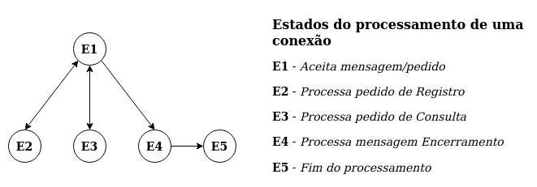

# sala_conversa_virtual

Trabalho da disciplina de 'Redes de Computadores 2'

<!-- TOC -->

- [sala_conversa_virtual](#sala_conversa_virtual)
    - [Objetivo](#objetivo)
    - [Informações](#informa%C3%A7%C3%B5es)
        - [Feito com](#feito-com)
        - [Requerimentos](#requerimentos)
            - [**Linux**](#linux)
            - [**Python3.8**](#python38)
        - [Execução](#execu%C3%A7%C3%A3o)
    - [Implementação da primeira parte do trabalho](#implementa%C3%A7%C3%A3o-da-primeira-parte-do-trabalho)
        - [___Interface servidor___](#___interface-servidor___)
        - [___Servidor___](#___servidor___)
        - [___Mensagens da aplicação___](#___mensagens-da-aplica%C3%A7%C3%A3o___)
        - [___Transmissao___](#___transmissao___)
        - [___Interface cliente___](#___interface-cliente___)
        - [___Cliente___](#___cliente___)
    - [Atualizações futuras](#atualiza%C3%A7%C3%B5es-futuras)
    - [Links](#links)
    - [Autores](#autores)

<!-- /TOC -->

---

## Objetivo

- Desenvolver uma aplicação que simula uma sala virtual de conversa, onde os diferentes usuários registrados podem realizar ligações de voz entre eles. Qualquer usuário registrado pode ligar para outro usuário registrado, permitindo somente conversação entre dois usuários. Para isso, a aplicação deve ter um módulo servidor de registros que contém uma tabela atualizada com todos os usuários registrados.
- Desenvolver uma aplicação baseado no paradigma cliente-servidor e utilizando socket de rede.
- A identificação do servidor de registro (endereço IP) deverá ser informada ao módulo cliente pelo usuário da aplicação.
- O servidor de registros deve usar a porta 5000 para a comunicação com os clientes.
- A troca de mensagens deve ser feita utilizando o protocolo TCP.
- O servidor deve imprimir na tela a lista de usuários registrados, sempre que adicione um novo usuário.
- Os módulos cliente e servidor devem imprimir na tela todas as mensagens enviadas e recebidas.
- A aplicação deve ter uma interface gráfica, mesmo sendo simples, seja intuitiva e satisfaça as funcionalidades da aplicação.

## Informações

### Feito com

- Python3.8
- tkinter

### Requerimentos

#### **Linux**

- pacote python3-pil
- pacote python3-pil.imagetk
- pacote python-imaging

Para instalar esses pacotes digite no terminal:

> `sudo apt-get install python3-pil python3-pil.imagetk python-imaging`

#### **Python3.8**

- Pillow

> Caso não queira instalar os requerimentos python desse projeto em todo o sistema, primeiramente crie e ative um ambiente virtual python, instale os requerimentos python e execute os scripts do projeto com o ambiente visual ativado.
>
> Para criar um ambiente abra a pasta do projeto no terminal e digite:
>
> `python3.8 -m venv .venv`
>
> Para ativar o ambiente virtual:
>
> `source .venv/bin/activate`
>
> Caso queira desativar o ambiente vitual:
>
> `deactivate`

Para instalar os requerimentos do Python digite:

> `python3.8 -m pip install -r ./requirements_python.txt`

### Execução

1. Abra a pasta do projeto no terminal;

2. Para executar o script do servidor, digite:

    > `python3.8 mainServidor.py`

3. Para executar o script do cliente, digite:

    > `python3.8 mainServidor.py`

---

## Implementação da primeira parte do trabalho

### ___Interface servidor___

A interface do servidor apresenta o endereço e a porta onde o servidor está sendo executado, dois botões, e uma área destinada aos logs feitos pelo servidor.

O primeiro botão ('Abrir Servidor') faz com que o servidor passe a aceitar novas conexões, o segundo botão ('Fechar servidor') faz com que ele pare de aceitar novas conexões; esse segundo botão não força que as conexões sendo processadas sejam interrompidas.

A área destinada aos logs é atualizada periodicamente (uma vez a cada 300ms) para exibir algumas das informações que o servidor processa, especificamente, as mensagens enviadas e recebidas pelo servidor e também a tabela de usuários registrados no servidor.

Ao fechar a interface do servidor, ele parará de ouvir por novas conexões e esperará que todas as conexões terminem.

> Obs.: A interface do servidor se encontra no módulo mainServidor em `./` (raiz do projeto)

### ___Servidor___

No momento em que o servidor é instanciado, um objeto do tipo socket também é instanciado, configurado como TCP, configurado como um socket não bloqueante, e é realizado o bind com o endereço localhost e a porta 5000. Um problema que surge com o socket bloqueante é que enquanto o servidor estiver esperando por uma conexão, se o programa pedir que ele pare de aceitar novas conexões, ele só poderá verificar esse comando depois que receba uma conexão. Por esse motivo o socket não é bloquenate nessa aplicação, para que quando ele começar a aceitar conexões, ele seja capaz de verificar se deve continuar aceitando ou se deve parar de aceitar novas conexões.

Quando o servidor passa a aceitar conexões, uma nova thread é iniciada para liberar a thread principal para a thread principal possa realizar outras tarefas que não estajam relacionadas diretamente com o servidor, essa thread criada fica responsável por receber as novas conexões e por verificar se deve parar de aceitar novas conexões. Ao receber uma nova conexão, mais outra thread é criada para tratar dessa conexão, liberando a thread anterior para aceitar outras conexões.

Com relação a lógica da aplicação, o servidor contém métodos para registrar um usuário na tabela usuários, consultar se um certo usuário está cadastrado na tabela e um método para descadastrar um usuário da tabela (a tabela de usuários é uma tabela em memória, implementada com o uso de um dicionário python).

O método para registrar um usuário armazena um nome, um ip e um número de porta internamente na tabela. O método de consulta retorna a linha inteira na tabela que corresponde a um nome passado como parâmetro e o método que descadastra um usuário percorre os valores da tabela buscando o endereço ip e porta que pediu o descadastramento e remove a linha associada a esse endereço e porta.

Além dos métodos referentes ao uso da aplicação, o servidor define métodos para receber um pedido, para processar um pedido de registro, processar um pedido de consulta e também um pedido de encerramento.

O método para recebimento de um pedido/mensagem terceiriza o trabalho para uma outra função (que faz parte do módulo mensagens_aplicacao, e essa função sim, sabe como receber mensagens/pedidos da aplicação), faz o log da mensagem recebida e ainda retorna a mensagem para que ela seja usada pelos outros métodos do servidor.

O método para _processar um pedido de registro_ aceita o nome que o usuário enviou através do cliente e tenta cadastrá-lo, dependendo do resultado do cadastro o servidor responde positivamente ou não ao cliente (a reposta é feita através de uma função do módulo mensagens_aplicacao) e faz o log da mensagem de resposta.

O método para _processar um pedido de consulta_ e de encerramento funciona de maneira análoga ao método para processar um registro (tentando consultar, respondendo de acordo com resultado da consulta e realizando o log da mensagem de resposta transmitida).

O método para _processar uma mensagem de encerramento_ simplesmente tenta descadastrar um usuário da tabela do servidor.

Todos os métodos de processamento são gerenciados por um 'processador' de conexões (uma implementação ad-hoc de máquina de estados) que chama e transiciona os estados de forma a atender à mensagem/ao pedido de cada conexão.

Além do que já foi mencionado, pelo fato do servidor poder trabalhar com várias threads, foi feito o uso de mutexes para algumas propriedades do servidor que são compartilhadas entre todas as threads do servidor para leitura e escrita, essas propriedades são, a tabela de usuário registrados e o objeto de log com os textos destinados as interface do servidor.

> Obs.: Esse módulo se encontra em `./src/cliente_servidor/`

### ___Mensagens da aplicação___

mensagens_aplicacao é o módulo responsável por manipular e padronizar as transmissões e os recepções de todas as mensagens e pedidos da aplicação. Tanto o envio de pedidos, quanto o envio de respostas ou o recebimento de pedidos e respostas estão definidos aqui e a manipulação dos bytes é delegada ao módulo transmissao.

Esse módulo também define uma enumeração com todas as possíveis mensagens e pedidos que a aplicação manipula, que atualmente são: pedido de registro, registro efetuado com exito, registro falhou, pedido de consulta, consulta efetuada com exito, consulta falhou e a mensagem de encerramento.

> Obs.: Esse módulo se encontra em `./src/aplicacao/`

### ___Transmissao___

transmissao é o módulo responsável por transmitir e receber bytes, esse módulo foi escrito para atender as recomendações da documentação do python3 [citadas aqui](https://docs.python.org/3/library/socket.html#socket.socket.send) e [aqui](https://docs.python.org/3/howto/sockets.html#using-a-socket). Resumindo a biblioteca de sockets requer que a aplicação seja responável por se certificar se todos os bytes foram enviados e recebidos através do socket. Para o controle do recebimento (isso é, saber quando todos os bytes de uma transmissão foram recebidos) esse módulo implementa o caractere stuffing para fazer a delimitação do início e o fim de uma mensagem.

> Obs.: Esse módulo se encontra em `./src/util/`

### ___Interface cliente___

A interface do cliente tem duas telas, onde a primeira tela tem por objetivo adquirir o nome de usuário que será registrado, adquirir o endereço Ip do servidor da aplicação e apresentar um botão para que o usuário interaja, iniciando após a interação, a tentativa de conexão e logo em sequência a tentativa de registro do nome de usuário na tabela do servidor, nessa tela também podem ser apresentados algumas mensagens de alerta notificando ao usuário caso ele não tenha fornecido um nome de usuário, ou caso o servidor não esteja aceitando conexões.

A segunda tela da interface do cliente dá opção para que o usuário envie uma requisição de consulta a um nome de usuário e receba o endereço ip e porta associados a esse nome na tabela de usuários registrados no servidor da aplicação, a interface dispõe uma área para apresentar os logs gerados a partir das transmissões enviadas e recebidas pelo cliente, além de um campo que será usado futuramente para que o usuário possa realizar uma ligação para outro usuário (_essa funcionalidade deverá ser implementada na segunda parte do trabalho_)

> Obs.: O código da interface do cliente está dividida em dois módulos, mainCliente em `./` (raiz do projeto) e tela_inicial que se encontra em `./src/interface/`

### ___Cliente___

O cliente é uma classe simples que implementa métodos para abrir a conexaõ com o servidor, métodos que fazem um pedido ao servidor e que retornam a resposta ao pedido; esses métodos que fazem um pedido e esperam um retorno são métodos que embrulham funções do módulo mensagens_aplicacao.

Ainda sobre os métodos do cliente, um deles faz o pedido de registro de um certo nome, recebendo a resposta desse pedido (se ele foi bem-sucedido ou não) e retorna para aplicação a mensagem enviada assim também como a mensagem recebida (esse retorno é para possibilitar a realização do log das mensagens transmitidas), outro método do cliente, de maneira análoga ao método anterior, tem por função realizar o pedido de consulta a um nome, um terceiro método do cliente envia uma mensagem de encerramentoao servidor e retorna a mensagem enviada ao servidor.

> Obs.: Esse módulo se encontra em `./src/cliente_servidor/`

---

## Atualizações futuras

- [ ] Permitir que usuários conectados façam ligações de voz

## Links

- [Repositório](https://github.com/gborba-uff-cc/sala_virtual_conversa)

## Autores

- [@gborba-uff-cc](https://github.com/gborba-uff-cc)

- [@JorgeStief](https://github.com/JorgeStief)
